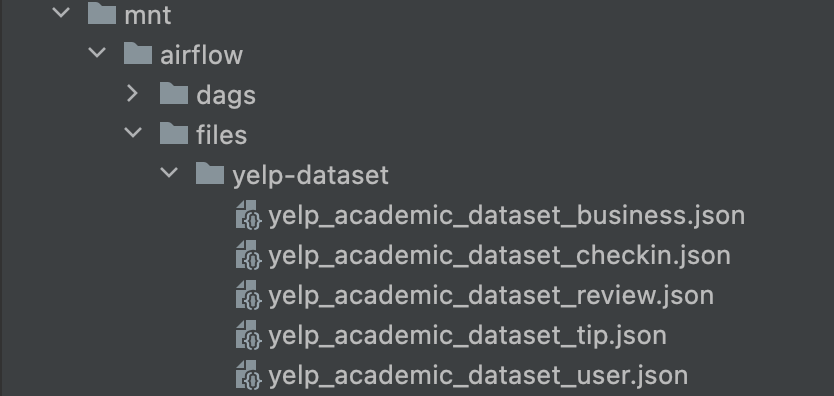
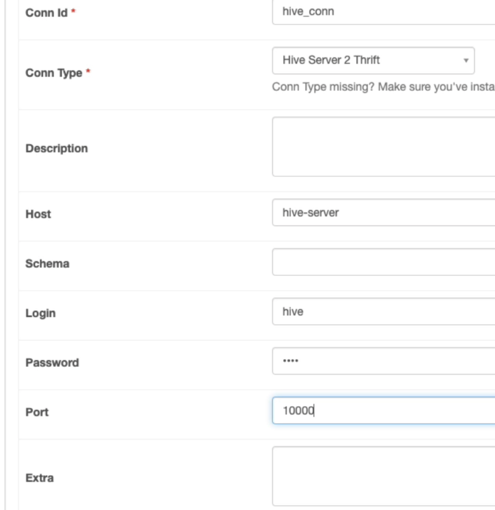
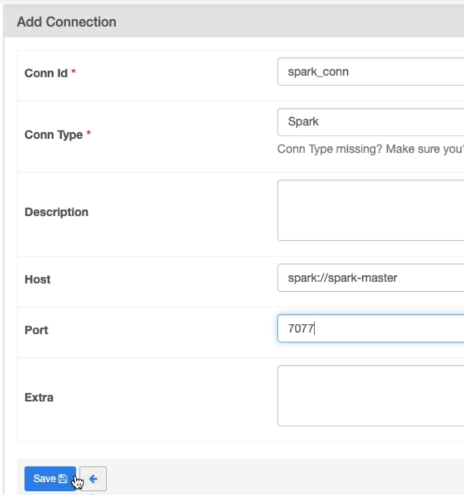

# MINI-DATALAKE

This is a "small" data lake created for the NewYorkers assessment.
It includes all the strictly mandatory component (Spark, Hadoop, Hive) and also some useful tools (Airflow, Hue)
All the services are running in docker containers

## Get the data
We fetch the data from the [yelp-dataset](https://www.kaggle.com/yelp-dataset/yelp-dataset).

### Manual download
Place the data under the folder `mnt/airflow/files/yelp-dataset` and it will be automatically copied into the container.
like in the screenshot:


### Kaggle API
To fetch the data from the Kaggle API the kaggle token need to be placed in `docker/airflow/api/kaggle/kaggle.json`. (NOT TESTED)

## Usage
### start datalake
The process can take some time during the first run.
```
bash start.sh
```
### stop datalake
```
bash stop.sh
```
### reset datalake
The image creation will be deleted
```
bash reset.sh
```


## Service ports table

| service | port                  |
|--------|-----------------------|
| Airflow | http://localhost:8080 |
| Hue    | http://localhost:32762 |
| HDFS   | http://localhost:32763 |
| Spark  | http://localhost:32766 |


## Connection needed on AirFlow
### Hue

- Conn id: hive-conn
- Conn Type: Hive Server 2 Thrift
- Host: hive-server
- Login: hive (check docker/postgres/init-hive-db.sh)
- Password: hive (check docker/postgres/init-hive-db.sh)
- Port: 10000



### Spark

- Conn id: spark-conn
- Conn Type: Spark
- Host: spark://spark-master
- Port: 7077



## Airflow DAG
The developed pipeline name is `ingest_yelp_from_local`.
If you are not familiar to Airflow, you can check the [Airflow documentation](https://airflow.apache.org/docs/stable/user-guide.html)

## Result
The result can be checked on Hue.

## Debugging
To debug the pipeline you can enter into the container with the command:
```
# to list all the containers IDs
docker ps

# to enter container shell
docker exec -it <container_id> /bin/bash
```

If any of the service is not working I suggest to restart all the services with these commands:
```
bash stop.sh
bash start.sh
```

## Requirements
- Docker (Allocate 8gb of RAM, 50GB of disk)
